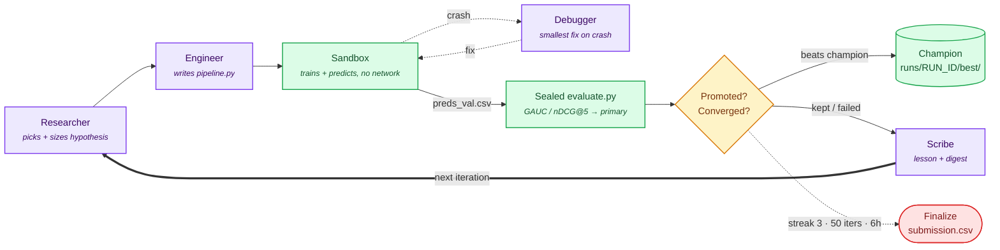

# Autonomous ML Research Agent — KuaiRand-Pure (TechJam 2026, Track 2)

An LLM-driven agent that improves a recommender pipeline **on its own**. A deterministic Python harness runs the
MLE loop — hypothesize → edit code → train → evaluate → reflect → log — against the KuaiRand-Pure within-user
ranking benchmark (label `long_view`, metric = mean(GAUC, nDCG@5)), trying to beat the organizers' factorization-
machine baseline (validation primary **0.6016**). Four LLM roles make every research decision; the harness owns
every guarantee (sealed scoring, promotion, convergence, budgets, logging, interventions) so the LLM can never
grade or checkpoint itself. Full design contract: `NOTES.md`.

## Architecture


Purple = LLM role, green = deterministic harness, amber = the promotion/convergence gate, red = terminal.

| Role | Job | Model (shipped) |
|---|---|---|
| **Researcher** | Decides the next hypothesis, sizes it against the convergence rule; never sees raw scores before they're measured | `google/gemini-3.1-pro-preview` |
| **Engineer** | Implements one experiment as a complete `pipeline.py` | `google/gemini-3.1-pro-preview` |
| **Debugger** | Smallest fix that makes a crashed experiment run, without changing the hypothesis | `deepseek/deepseek-v4-flash` |
| **Scribe** | Writes the per-iteration lesson, narrative log, and a cross-run research digest — all number-checked against harness facts, never its own opinion | `mistralai/codestral-2508` |

The harness (not the LLM) computes every score, promotion, and stop decision from measured values; keeps the
champion checkpoint byte-identical unless a real improvement lands; and enforces stopping rules — streak ≥ 3 flat
(ε = 0.002), 50 iterations, 6 h wall clock, spend guard. See `agent/promotion.py`, `agent/harness.py`.

<details>
<summary>Researcher/Engineer model choice: Gemini 3.1 Pro vs. Claude Sonnet 5 (bake-off)</summary>

Two otherwise-identical full runs on KuaiRand-Pure (same harness/config/Debugger/Scribe), differing only in
which model drove Researcher + Engineer:

| Model | best val primary | Δ vs baseline | iterations | tokens | wall-clock | spend | source |
|---|---|---|---|---|---|---|---|
| `google/gemini-3.1-pro-preview` | 0.6049 | +0.0033 | 3/50 | 134,858 | 0:11 | $0.70 | `runs/20260901_005427_gemini_pro_baseline/results_summary.md` |
| `anthropic/claude-sonnet-5` | 0.6049\* | +0.0032 | 4/50 | 472,975 | 0:40 | $1.92 | `runs/20260901_011854_sonnet5_pure_v2/results_summary.md` |

\*best leak-clean measurement (it04); the promoted champion was it02 at 0.6048.

For essentially identical quality, Sonnet used **~3.5x the tokens** and **~2.7x the spend**. Gemini 3.1 Pro was
kept on that cost/quality trade-off.
</details>

## Setup
```bash
git clone <this repo> && cd kuairand-research-agent
python3 -m venv .venv && source .venv/bin/activate
pip install -r requirements.txt   # numpy pandas scikit-learn lightgbm pyyaml anthropic openai requests pytest

# Organizer data (47 MB), inside starter_kit/ — see starter_kit/README.md
cd starter_kit && curl -L -o KuaiRand-Pure.tar.gz https://zenodo.org/records/10439422/files/KuaiRand-Pure.tar.gz \
  && tar xzf KuaiRand-Pure.tar.gz && rm KuaiRand-Pure.tar.gz && cd ..
```
API key: put `OPENROUTER_API_KEY=sk-or-...` in a `.env` file at the repo root (gitignored, never logged, never
readable by the sandbox). Model ids live in `config.yaml`; other providers (`ANTHROPIC_API_KEY`, `GEMINI_API_KEY`,
etc.) are supported via `--llm-profile <name>` — see `config.yaml: llm.profiles`.

## Reproduce
```bash
# Official baseline (organizers' own script, unmodified) — the number every delta here is measured against
cd starter_kit && python3 baseline.py --model fm   # GAUC 0.6674 / nDCG@5 0.5357 / primary 0.6016

# Full test suite
.venv/bin/python -m pytest -q

# Phase 0 self-check (rungs + baseline + champion), no API key
.venv/bin/python -m agent.harness --mock --phase0-only

# Official run: Phase 0, then up to 50 iterations, then finalize
.venv/bin/python -m agent.harness --label official

# Deterministic offline dry run (no API key)
.venv/bin/python -m agent.harness --mock --label dryrun
```
Each run lands in its own `runs/<RUN_ID>/`: `submission.csv`, `results_summary.md`, `ledger.md`,
`iterations/itNN/` (code, diffs, metrics, LLM transcripts), `best/` (champion), `interventions.md`, `run_state.json`.

## Results Summary

**KuaiRand-Pure** — `runs/20260901_005427_gemini_pro_baseline/`

| | GAUC | nDCG@5 | primary |
|---|---|---|---|
| Published baseline | 0.6674 | 0.5357 | 0.6016 |
| Agent (best val, it03) | 0.6716 | 0.5382 | **0.6049** |
| **Δ (valid vs. valid)** | +0.0042 | +0.0025 | **+0.0033** |

3/50 iterations, 16 LLM calls, 134,858 tokens, wall-clock 0:11, 0 GPU-hours, 0 manual interventions.
`submission.csv` (170,588 rows) passed the kit's checker.

**KuaiRand-1K (bonus)** — no organizer baseline exists; the row below is a **self-measured** reproduction of the
unmodified FM baseline (`starter_kit_1k/`, ported filenames, same code/hyperparameters), reported side by side,
not netted — `runs/20260831_145457_1k_bonus_test/`

| | GAUC | nDCG@5 | primary |
|---|---|---|---|
| Self-measured FM baseline | 0.6752 | 0.6105 | 0.6428 |
| Agent (best val, it05) | 0.6788 | 0.6339 | **0.6563** |

5/50 iterations, 31 LLM calls, 494,477 tokens, wall-clock 7:26, **3 manual interventions**.
**Not fully autonomous**: KuaiRand-1K has no organizer starter kit, so a human built the `starter_kit_1k/`
scaffolding (filename-ported data/eval/baseline/submit scripts) before Phase 0 — the Researcher/Engineer/Debugger
loop itself then ran unmodified. Full disclosure in that run's `results_summary.md` Warnings section.

## Run & Iteration Logs
Every `runs/<RUN_ID>/` carries the Starter Kit's required per-iteration record:
- **Hypothesis + why** → `iterations/itNN/plan.json`, `logs/iter_NN.md`
- **Code diff applied** → `iterations/itNN/pipeline.py` vs. the prior champion; LLM transcripts in `iterations/itNN/llm/`
- **Metrics (GAUC/nDCG@5)** → `iterations/itNN/result.json`, `logs/iter_NN.json` (sealed `evaluate.py` output)
- **Errors/recovery** → Debugger transcripts + `stdout.txt`/`stderr.txt` per attempt; `results_summary.md` Warnings
- **Manual interventions** → `interventions.md` per run + counter in `run_state.json`: **0** (Gemini bake-off run),
  **0** (Sonnet bake-off run), **3** (KuaiRand-1K — 1 deliberate pause/resume, 1 infra-failure recovery, 1 routine
  phase-transition; see above)

## Dashboard
`dashboard/index.html` — static, no build step, no server. Open directly in a browser. Its data is baked in at
generation time (`window.RUNS`); regenerate it from a run's `run_state.json` + `logs/iter_NN.json` after new runs.

## Limitations & what we'd improve
* **OS-level sandboxing is macOS-only** (`sandbox-exec`) and did not engage on any cited run — all three log
  `sandbox isolation: none` on this project's Linux host. On Linux only the static code/import guard and env
  stripping apply; a `unshare -n`/container wrapper is the fix, not yet implemented.
* **The hidden-test read-denial is a Linux no-op.** Experiments run on a derived, hidden-test-free data directory
  (real, unconditional), but the *extra* macOS-only read-deny layer on the full data dir doesn't run on Linux —
  and `data_cache/loop_train_valid/README_LOOP_DATA.txt` names the excluded path in plaintext inside the
  directory the sandbox can read. No generated pipeline has exploited this, but nothing at the OS level stops one
  on Linux. <details><summary>why</summary>`agent/task.py`'s `deny_read=[self.data_dir]` is only enforced by
  `sandbox.py`'s `sandbox-exec` path, which requires macOS (`sys.platform == "darwin"`) — on Linux `isolation`
  falls back to `"none"` and the deny list is computed but never applied.</details>
* **Researcher web-tool scope**: `research_tools.enabled: true` gives the harness *process* (not the sandbox)
  outbound access for `arxiv_search`/`web_fetch`, host-restricted to `arxiv.org` in code (`agent/research_tools.py`),
  not just by prompt instruction.
* One experiment per iteration, sequential — no parallel candidates. Timeouts are terminal by default.
* The knowledge library (`knowledge/library.md`) is a hand-written playbook, not validated beyond the organizers'
  own published numbers.
* The bake-off above is one run per model — per-run variance hasn't been separated from real model-quality
  difference; a few repeats per model would tighten the claim.
* KuaiRand-1K depends on a human-built scaffolding step (see Results Summary) rather than the agent's own on-ramp
  to a new dataset — wiring it in properly is the next step.
* Dashboard data is regenerated manually, not automatically, from the latest runs.

See `NOTES.md` §5 for the full "what works / what's untested / what to verify" list.

## Team Contributions
Benjamin, Chengke, Chermaine, Aaron, and Ryan contributed equally across the whole project — harness and agent
design, prompt engineering, sandboxing/safety, evaluation and testing, and documentation were collaborative and
overlapping rather than split into separately owned modules.
